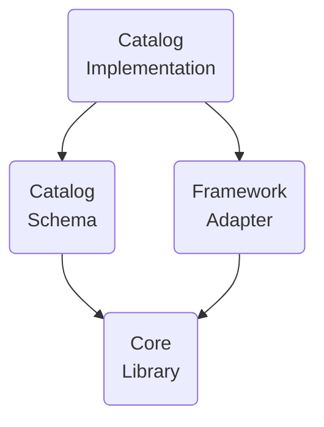

# 术语表

## A2UI 协议术语

A2UI 协议所需的术语。

### A2UI 智能体 (Agent) 和 A2UI 渲染器 (Renderer)

A2UI 协议使**智能体 (Agent)** 和**渲染器 (Renderer)** 之间的对话成为可能：
1. **渲染器 (Renderer)** 以 A2UI 目录 (Catalog) 的形式提供**UI 能力**，以及如何使用它的**说明**。
2. **智能体 (Agent)** 在循环中迭代：
    - 考虑接收到的目录 (Catalog)，提供**UI** 和可调用的**函数 (Function)**
    - 接收由渲染器传达的**用户输入**
    - 更新要在 UI 中显示的**数据**

虽然该协议是为**AI 驱动的智能体**设计的，但它也可以与确定性智能体一起工作。例如，智能体可能会返回预先制作好的 A2UI UI。

如果智能体是无状态的，或者不能保证保留目录 (Catalog)，渲染器应该在每条消息中提供目录 (Catalog)。

有时候，智能体使用预定义的目录 (Catalog)，因此强制渲染器要么支持该目录，要么使用适配器。

### GenUI 组件 (Component)

允许智能体使用的 UI 组件。例如：日期选择器、轮播图、按钮、酒店选择器。

### 目录 (Catalog)

1. 渲染器能力的逐项列表：
    - 智能体可用于生成 UI 的组件列表
    - 可由渲染器调用的函数列表
    - 样式和主题
2. 关于如何使用渲染器能力的说明。

可以观察到，根据用例的不同，目录 (Catalog) 组件可能对领域的具体程度有所不同：

- **较少特定**：

  基本 UI 原语，如按钮、标签、行、列、选项选择器等。

- **较多特定**：

  如 HotelCheckout 或 FlightSelector 之类的组件。

### 基础目录 (Basic Catalog)

由 A2UI 团队维护的目录 (Catalog)，用于快速上手 A2UI。

参见 [基础目录 (Basic Catalog)](../specification/v0_10/json/basic_catalog.json)。

### 表面 (Surface)

由 A2UI 智能体构建并由 A2UI 渲染器管理的 UI 区域，由多个组件组成。表面 (Surface) 不能嵌套。

### 智能体架构

A2UI 智能体的选项包括：

- **同进程或服务器端**：

  智能体和渲染器可能位于客户端应用程序的一个进程中。例如：桌面 Flutter 应用程序。

  或者，渲染器可能位于显示 UI 的机器上，而智能体可能位于另一台机器（服务器）上。

- **编排智能体 (Orchestrator Agent)**：

  中央编排器管理用户与多个专用子智能体之间的交互。编排器可以在同一进程中，也可以在服务器上。

- **拉取 / 推送**：

  智能体可以等待来自渲染器的消息/请求，也可以向渲染器推送消息/请求。

- **有状态 / 无状态**：

  智能体可以保留状态，也可以是无状态的。

- **与其他协议混合**：

  A2UI 可以与其他协议结合使用。例如，智能体可以是 MCP 和/或 A2A 服务器。

- **其他**：

  除了上述选项外，还可能有任意自定义变体。

### 渲染器技术栈

A2UI 渲染器的功能由可以分别开发和复用的层组成：

- **核心库 (Core Library)**：

  描述目录 (Catalog) 和与智能体交互所需的一组原语。

  例如，参见 [JavaScript Web 核心库](../renderers/web_core/README.md)。

- **目录 Schema (Catalog Schema)**：

  以 JSON 形式定义的目录 (Catalog)。

  例如，参见 [基础目录 Schema](../specification/v0_10/json/basic_catalog.json)。

- **框架适配器 (Framework Adapter)**：

  在具体框架中实现智能体指令执行的代码。例如：

  - JavaScript 核心库和目录 (Catalog) 可以适配到 Angular、Electron、React 和 Lit 框架。
  - Dart 核心库和目录 (Catalog) 可以适配到 Flutter 和 Jaspr 框架。

  参见 [Angular 适配器](../renderers/angular/README.md)。

- **目录实现 (Catalog Implementation)**：

  为框架实现目录 Schema。

  例如：

  - 参见 [基础目录的 Angular 实现](../renderers/angular/src/v0_9/catalog/basic)

### A2UI 消息 (Message)

智能体和渲染器之间的消息。

由于协议允许流式传输，任何消息都可以是完成的（完全传递）或未完成的（部分传递）。已完成的消息可能是完整的（成功传递）或被中断的（由于某些技术问题而停止传递）。

参见 [数据流指南](concepts/data-flow.md)。

### 智能体轮次 (Agent Turn)

智能体在开始等待用户输入之前发送的一组消息。

### 数据模型 (Data Model)

在渲染器和智能体之间共享的、可由双方更新的、可观察的、分层的类 JSON 对象。每个表面 (Surface) 都有单独的数据模型。

组件可以绑定到数据模型的节点，以便在值发生变化时自动更新。

数据模型允许双向同步——将用户交互捕获到状态对象中以传输给智能体，同时允许智能体将数据更新推回到 UI。

参见 [数据绑定指南](concepts/data-binding.md)。

### 数据引用 (Data Reference)

在组件定义中，对数据元素的引用，可以通过数据模型中的路径或值来解析。

参见 [基础目录中的示例](../specification/v0_10/json/basic_catalog.json#L18)。

### 客户端函数 (Client Function)

智能体在需要时调用的函数。

不要与 LLM 工具 (Tool) 混淆：

| 特性 | 客户端函数 (Client Function) | LLM 工具调用 (LLM Tool Invocation) |
|------|------|------|
| 执行者 | A2UI 渲染器 (Renderer) | LLM 请求调用，不关心执行细节。 |
| 时机 | 在智能体到渲染器的消息发送之后。 | 在智能体到渲染器的消息发送之前。 |
| 目的 | UI 逻辑（验证、可见性切换、格式化） | 推理、数据获取、后端操作 |
| 定义 | 在客户端函数注册表中注册并在目录 (Catalog) 中公布 | 在 ToolDefinition 中定义（传递给 LLM） |
| 状态访问 | 可访问 DataContext 和输入值。 | 无法访问触发器来请求 AI。可访问外部 API、数据库和服务。 |

参见 [常见类型中的示例](../specification/v0_9/json/common_types.json#L200)。

### 操作 (Action)

用户在 UI 中触发的交互的容器。操作有两种类型：
- **事件 (Event)**：分派给智能体处理（例如，单击"提交"）。
- **函数 (Function)**：在渲染器本地执行（例如，打开一个 URL）。

参见 [操作详细指南](concepts/actions.md)。

## 生成式 UI 术语

A2UI 协议不要求但常在生成式 UI 上下文中使用的术语。

### 已知的 GenUI 模式

- **聊天 (Chat)**：

  生成的 UI 片段按时间顺序逐个出现在可垂直滚动的区域中，与用户输入混合。

- **画布 (Canvas)**：

  与智能体协作的空间。

- **仪表板 (Dashboard)**：

  生成的 UI 片段不是按时间，而是按其含义来组织，并可靠地（也称为固定）停留在用户期望看到的位置。

- **向导 (Wizard)**：

  生成的 UI 片段逐个显示，目的是为特定任务收集必要信息。

### NoAI 信息

被归类为**AI 不可访问**的信息（例如信用卡信息）。

哪些信息不应被 AI 访问由应用程序的所有者定义，并且**在不同上下文中有所不同**。例如，在某些上下文中，医疗记录永远不应发送到 AI，而在其他上下文中，AI 被大量用于帮助医疗诊断，因此需要医疗记录。

这个术语在 GenUI 上下文中很重要，因为最终用户希望**清楚地看到**哪些输入可以发送到 AI，哪些不可以。
