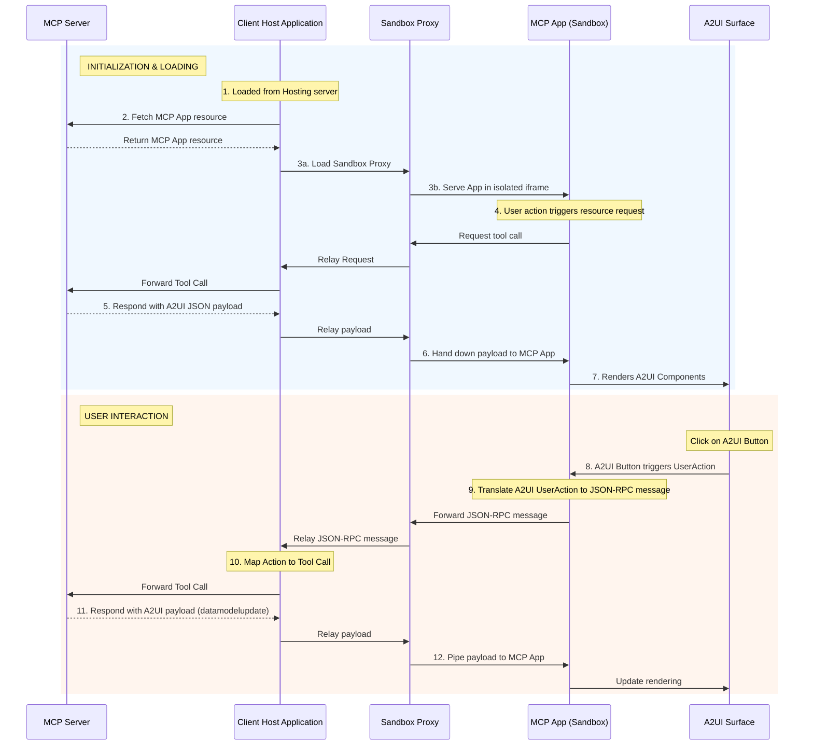

# MCP 应用中的 A2UI 动态渲染

本指南展示如何使用工具（Tools）和嵌入资源（Embedded Resources）在 [MCP 应用](https://modelcontextprotocol.io/extensions/apps/overview) 中提供丰富的交互式 A2UI 界面。完成本指南后，你将拥有一个可工作的 MCP 服务器，该服务器返回的 MCP 应用可以渲染 A2UI 组件并处理 A2UI 交互。通过在 MCP 应用中支持原生 A2UI，你的 MCP 服务器可以在保持 UI 样式一致性的同时，与远程智能体（Agent）安全协作。


## 前提条件

- **[Python 3.10+](https://www.python.org/)**
- **[uv](https://docs.astral.sh/uv/)** — 快速的 Python 包管理器
- **[Node.js 18+](https://nodejs.org/)**（用于 MCP Inspector）

## 快速开始：运行示例

有关如何运行此示例的详细说明，请参阅 [README.md](https://github.com/google/A2UI/blob/main/samples/agent/mcp/a2ui-in-mcpapps/README.md)。

## 架构概览

该系统由三个主要参与者通过通信链交互组成：

1.  **客户端主机应用（Client Host Application）**：外部容器（例如 Angular 应用），连接到 MCP 服务器并为 MCP 应用托管安全沙箱。
2.  **MCP 应用（沙箱化）**：不受信任的第三方 Web 应用（例如 Lit 或 Angular 微应用），在双 iframe 沙箱中运行。此应用包含 A2UI 表面（Surface）。
3.  **MCP 服务器**：提供应用资源并处理工具调用的后端服务器。


## 深入解析：通信流程

此模式的一个关键方面是 **MCP 应用**直接渲染 A2UI 载荷（payload），而不是依赖客户端主机应用来渲染。

### 在 MCP 应用中加载 A2UI 组件

以下是将 A2UI 组件动态加载到 MCP 应用中的事件序列：

1.  **触发**：MCP 应用决定需要获取或更新 UI 内容（例如在初始化时或通过用户发起的动作）。
2.  **请求**：MCP 应用通过 `window.parent.postMessage` 向主机发送 JSON-RPC 请求。
    *   *示例方法*：`ui/fetch_counter_a2ui`
3.  **中继**：沙箱代理（Sandbox Proxy）将此消息中继给客户端主机。
4.  **MCP 调用**：客户端主机将此自定义消息转换为标准的 MCP `tools/call` 请求发送给 MCP 服务器。
    *   *示例工具*：`fetch_counter_a2ui`
5.  **响应**：MCP 服务器执行工具并返回包含 `application/json+a2ui` 资源的结果。
6.  **响应转发**：主机接收工具结果并通过沙箱代理将其向下转发给 MCP 应用。
7.  **渲染**：MCP 应用从资源中提取 A2UI JSON 载荷并将其输入到本地 A2UI `MessageProcessor`，从而动态更新 A2UI 表面。

### 处理用户动作

通过反转流程来处理渲染后的 A2UI 表面内的交互性：

1.  用户在 MCP 应用内的 A2UI 表面中点击按钮。
2.  A2UI 组件触发 `userAction`。
3.  MCP 应用通过 A2UI `MessageProcessor.events` 订阅捕获此事件。
4.  MCP 应用将动作打包并作为 JSON-RPC 消息发送给主机（例如 `ui/increase_counter`）。
5.  主机在 MCP 服务器上调用相应的工具。
6. 服务器返回新的 A2UI 载荷（表示更新后的状态），将其传回 MCP 应用以更新渲染。

### 序列图



## 如何实现

要构建具有 A2UI 功能的自有 MCP 应用，请按照以下步骤操作：

### 第 1 步：内联渲染器

MCP 应用通常作为来自 MCP 服务器的单个 HTML 资源交付。要使用 Angular 或 React 等现代框架实现这一点：

1.  正常构建应用程序以生成静态资源（`index.html`、`.js`、`.css`）。
2.  使用构建后脚本（如示例中的 [`inline.js`](https://github.com/google/A2UI/blob/main/samples/agent/mcp/a2ui-in-mcpapps/server/apps/src/inline.js) 脚本）读取 `index.html`，并将外部 `<script src="...">` 和 `<link rel="stylesheet" href="...">` 标签替换为包含实际文件内容的内联 `<script>` 和 `<style>` 标签。
3.  这将生成一个自包含的 HTML 文件，可以通过受限 iframe 中的 `srcdoc` 安全加载。

::: tip
使用 Vite 进行内联

如果你的项目使用 Vite（React、Vue 或 Lit 常用），你可以使用 `vite-plugin-singlefile` 等插件自动实现相同的单文件输出。这消除了对自定义构建后脚本的需求，在构建过程本身中处理内联。

**使用方法：**

1. **安装插件**：

   ```bash
   npm install -D vite-plugin-singlefile
   ```

2. **配置 Vite**：将插件添加到你的 `vite.config.ts`（或 `.js`）中：

   ```typescript
   import { defineConfig } from 'vite'
   import { viteSingleFile } from 'vite-plugin-singlefile'

   export default defineConfig({
     plugins: [viteSingleFile()],
   })
   ```

   这将确保所有 JS 和 CSS 资源在构建时内联到 `index.html` 文件中，使其可以准备就绪，由你的 MCP 服务器作为单个资源提供服务。

:::

### 第 2 步：利用 A2UI-over-MCP

你的内联应用现在正在沙箱中运行。要利用 A2UI：

1.  **在你的应用捆绑包中包含 A2UI Angular/Lit 库**。
2.  **与你的主机定义通信协议**以与 MCP 服务器交互。
3.  当你从主机收到响应时，在内容中查找 `application/json+a2ui` mimeType。
4.  解析 JSON 文本并将其传递给 A2UI [`MessageProcessor`](https://github.com/google/A2UI/blob/main/renderers/angular/src/v0_8/data/processor.ts)。

**示例：获取和渲染 A2UI**


```typescript
// 1. 从主机请求 A2UI 数据
const result = await callHostMethod("ui/fetch_counter_a2ui");

// 2. 查找并解析 A2UI 资源
const a2uiResource = result.find(c => 
    c.type === 'resource' && c.resource?.mimeType === 'application/json+a2ui'
);

if (a2uiResource?.resource?.text) {
    const messages = JSON.parse(a2uiResource.resource.text);
    this.processor.processMessages(messages);
}


// 用于 JSON-RPC 通信的实用工具函数
function callHostMethod(method: string, params: any = {}): Promise<any> {
    return new Promise((resolve, reject) => {
        const requestId = `${method}-${Date.now()}`;
        
        const handler = (event: MessageEvent) => {
            if (event.data.id !== requestId) return;
            window.removeEventListener('message', handler);
            
            if (event.data.error) {
                reject(event.data.error);
            } else {
                resolve(event.data.result);
            }
        };
        
        window.addEventListener('message', handler);
        
        window.parent.postMessage({
            jsonrpc: "2.0",
            id: requestId,
            method,
            params
        }, "*"); // 注意：在生产中应将 "*" 替换为明确的目标来源
    });
}
```

### 第 3 步：处理 A2UI 组件上的用户动作

要在渲染后的 A2UI 表面中处理交互性，你的 MCP 应用必须捕获 A2UI 事件并通过 JSON-RPC 将它们转发给主机。

**示例：处理用户动作**

```typescript
// 在 MCP 应用中订阅 A2UI 事件 ([main.ts](https://github.com/google/A2UI/blob/main/samples/agent/mcp/a2ui-in-mcpapps/server/apps/src/src/main.ts))
this.processor.events.subscribe(async (event) => {
  if (!event.message.userAction) return;
  
  const method = `ui/${event.message.userAction.name}`;
  const params = event.message.userAction.context;

  try {
      // 将 A2UI UserAction 转换为 JSON-RPC，发送给主机，并等待响应
      const result = await callHostMethod(method, params);
      
      // 解析更新后的 A2UI 载荷并更新渲染
      const messages = extractA2UIMessages(result);
      if (messages) {
          this.processor.processMessages(messages);
      }
  } catch (error) {
      console.error(`Error handling user action[${method}]:`, error);
  }
});
```

此模式使 MCP 应用能够充当 MCP 服务器 A2UI 功能的动态接口，同时保持严格的安全隔离。

## 安全注意事项

-   **明确的目标来源**：如果已知主机来源，在调用 `postMessage` 时始终使用特定的目标来源（例如 `'https://trusted-host.com'`）而不是 `*`。这可以防止恶意 iframe 拦截你的 RPC 请求。
-   **空来源处理**：请记住，在严格沙箱内（`sandbox="allow-scripts"` 不含 `allow-same-origin`），`window.location.origin` 将计算为 `"null"`。你必须通过将 `event.source` 与预期的窗口对象（例如 `window.parent`）进行比较来仔细验证传入消息。
