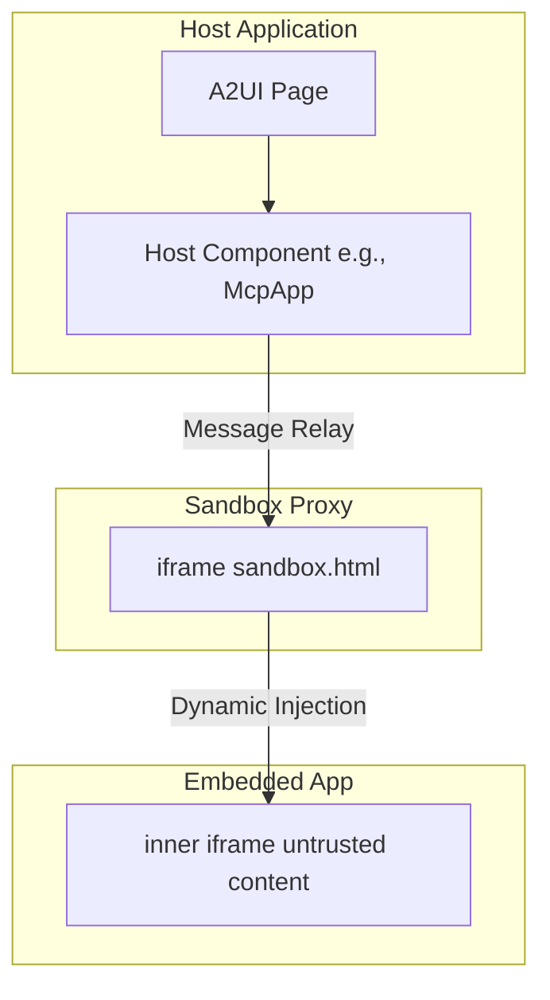

# MCP 应用在 A2UI 表面中的集成

本指南解释 **模型上下文协议（MCP）应用**如何在 **A2UI** 表面内集成和显示，以及安全模型和测试指南。

> 注意：在寻找核心的 A2UI-over-MCP 协议？请参阅 [通过 MCP 提供 A2UI](a2ui_over_mcp.md)，了解如何从 MCP 工具调用返回 A2UI JSON 载荷。

## 概览

模型上下文协议（MCP）允许 MCP 服务器向主机交付丰富的交互式基于 HTML 的用户界面。A2UI 提供了一个安全环境来运行这些第三方应用。


## 双 iframe 隔离模式

为了安全地运行不受信任的第三方代码，A2UI 利用了**双 iframe** 隔离模式。这种方法将原始 DOM 注入与主应用隔离，同时保持结构化的 JSON-RPC 通道。

### 安全原理

带有 `allow-scripts` 的标准单 iframe 沙箱化如果与 `allow-same-origin` 结合使用，通常会被绕过，这会破坏容器化。任何具有 `allow-scripts` 和 `allow-same-origin` 的 iframe 都可以通过与其父 DOM 进行编程交互或移除自己的沙箱属性来逃离沙箱。

为了防止这种情况，A2UI 严格排除内部 iframe 的 `allow-same-origin`，第三方应用在其中运行。

### 架构

1.  **[沙箱代理（`sandbox.html`）](https://github.com/google/A2UI/blob/main/samples/client/shared/mcp_apps_inner_iframe/sandbox.html)**：来自同一来源的中间 `iframe`。它将原始 DOM 注入与主应用隔离，同时保持结构化的 JSON-RPC 通道。
    -   权限：在主机组件模板中**不要添加沙箱**（例如 [`mcp-app.ts`](https://github.com/google/A2UI/blob/main/samples/client/angular/projects/mcp_calculator/src/a2ui-catalog/mcp-app.ts) 或 [`mcp-apps-component.ts`](https://github.com/google/A2UI/blob/main/samples/client/lit/custom-components-example/ui/custom-components/mcp-apps-component.ts)）。
    -   主机来源验证：验证消息来自预期的主机来源。
2.  **嵌入应用（内部 iframe）**：最内层的 `iframe`。通过 `srcdoc` 动态注入，具有受限权限。
    -   权限：`sandbox="allow-scripts allow-forms allow-popups allow-modals"`（**绝不能**包含 `allow-same-origin`）。
    -   隔离：由于唯一来源，移除对 `localStorage`、`sessionStorage`、`IndexedDB` 和 Cookie 的访问。

### 架构图



## 使用 / 代码示例

MCP 应用组件通常解析为 A2UI 目录中的 `custom` 节点。以下是开发者如何在代码中使用它。

### 1. 在目录中注册

你必须在目录应用中注册组件。例如，在 Angular 中：

```typescript
import { Catalog } from '@a2ui/angular';
import { inputBinding } from '@angular/core';

export const DEMO_CATALOG = {
  McpApp: {
    type: () => import('./mcp-app').then((r) => r.McpApp),
    bindings: ({ properties }) => [
      inputBinding(
        'content',
        () => ('content' in properties && properties['content']) || undefined,
      ),
      inputBinding('title', () => ('title' in properties && properties['title']) || undefined),
    ],
  },
} as Catalog;
```

### 2. 在 A2UI 消息中使用

在主机或智能体上下文中，发送转换为该自定义节点的 A2UI 消息。

```json
{
  "type": "custom",
  "name": "McpApp",
  "properties": {
    "content": "<h1>Hello, World!</h1>",
    "title": "My MCP App"
  }
}
```

如果内容复杂或需要编码，你可以传递 URL 编码的字符串：

```json
{
  "type": "custom",
  "name": "McpApp",
  "properties": {
    "content": "url_encoded:%3Ch1%3EHello%2C%20World!%3C%2Fh1%3E",
    "title": "My MCP App"
  }
}
```

## 通信协议

主机和嵌入的内部 iframe 之间的通信通过 `postMessage` 上的结构化 JSON-RPC 通道进行。

-   **事件**：主机组件侦听来自代理的 `SANDBOX_PROXY_READY_METHOD` 消息。
-   **桥接**：`AppBridge` 处理消息中继。开发者（特别是非信任 iframe 中的 MCP 应用开发者）可以使用 `bridge.callTool()` 在 MCP 服务器上调用工具。
-   **主机**：解析回调（例如特定大小调整、工具结果）。

### 限制

由于最内层 iframe 严格省略了 `allow-same-origin`，以下条件适用：
-   MCP 应用**不能**使用 `localStorage`、`sessionStorage`、`IndexedDB` 或 Cookie。每个应用都以唯一来源运行。
-   父级直接 DOM 操作被阻止。所有交互必须通过消息传递进行。

## 前提条件

要运行示例，请确保已安装以下内容：

-   **Python 3.10+** —— 智能体和 MCP 服务器后端所需
-   **[uv](https://docs.astral.sh/uv/)** —— 快速 Python 包管理器（用于运行所有 Python 示例）
-   **Node.js 18+** 和 **npm** —— 构建和运行客户端应用所需
-   **`GEMINI_API_KEY`** —— 所有基于 ADK 的智能体所需。从 [Google AI Studio](https://aistudio.google.com/apikey) 获取

> ⚠️ **环境变量设置**：你可以在 shell 中导出 `GEMINI_API_KEY` 或在每个智能体目录中创建 `.env` 文件。智能体使用 `dotenv` 自动加载 `.env` 文件。
>
> ```bash
> # 选项 1：在 shell 中导出
> export GEMINI_API_KEY="your-api-key-here"
>
> # 选项 2：在智能体目录中创建 .env 文件
> echo 'GEMINI_API_KEY=your-api-key-here' > .env
> ```

## 示例

有两个主要示例演示 MCP 应用集成。每个示例都需要运行**多个终端**——每个后端服务一个，客户端一个。

---

### 1. MCP 应用独立示例（Lit & ADK 智能体）

此示例使用基于 Lit 的客户端和基于 ADK 的 A2A 智能体验证沙箱。

-   **A2A 智能体服务器**：
    -   路径：[`samples/agent/adk/mcp-apps-in-a2ui-sample/`](https://github.com/google/A2UI/tree/main/samples/agent/adk/mcp-apps-in-a2ui-sample/)
    -   命令：`uv run .`（需要在 `.env` 中有 `GEMINI_API_KEY`）
-   **Lit 客户端应用**：
    -   路径：[`samples/client/lit/mcp-apps-in-a2ui-sample/`](https://github.com/google/A2UI/tree/main/samples/client/lit/mcp-apps-in-a2ui-sample/)
    -   命令：`npm install && npm run dev`（需要先构建 Lit 渲染器）
    -   URL：`http://localhost:5173/`

**预期效果**：一个简单的界面加载 MCP 应用，带有一个按钮来触发由智能体处理的动作。

### 2. MCP 应用（计算器 + Pong）（Angular）

#### 第 3 步：在浏览器中打开

打开你的浏览器并导航到 `http://localhost:5173`。你应该会看到加载 MCP 应用的 A2UI 界面。

**预期效果**：一个在沙箱化 iframe 中加载 MCP 应用的页面。点击 iframe 内的"Call Agent Tool"按钮将触发由智能体处理的动作。

---

### 示例 2：MCP 应用（计算器 + Pong）（Angular 客户端 + MCP 服务器 + 代理智能体）

此示例使用基于 Angular 的客户端、MCP 代理智能体和远程 MCP 服务器验证沙箱。它需要**三个**后端进程。

#### 第 1 步：启动 MCP 服务器（计算器）

```bash
cd samples/agent/mcp/mcp-apps-calculator/
uv run .
```

=======
```bash
cd samples/client/lit/mcp-apps-in-a2ui-sample
npm install
npm run dev
```

客户端在 `http://localhost:5173/` 启动。

#### 第 2 步：启动智能体

在单独的终端中，导航到智能体目录并启动智能体：

```bash
cd samples/agent/adk/mcp-apps-in-a2ui-sample
uv run agent.py
```

智能体将在 `http://localhost:8000` 上运行。

#### 第 3 步：在浏览器中打开

打开你的浏览器并导航到 `http://localhost:5173`。你应该会看到加载 MCP 应用的 A2UI 界面。

**预期效果**：一个在沙箱化 iframe 中加载 MCP 应用的页面。点击 iframe 内的"Call Agent Tool"按钮将触发由智能体处理的动作。

---

### 示例 2：MCP 应用（计算器 + Pong）（Angular 客户端 + MCP 服务器 + 代理智能体）

此示例使用基于 Angular 的客户端、MCP 代理智能体和远程 MCP 服务器验证沙箱。它需要**三个**后端进程。

#### 第 1 步：启动 MCP 服务器（计算器）

```bash
cd samples/agent/mcp/mcp-apps-calculator/
uv run .
```
>>>>>>> e3c17f1f (docs: add npm install step to MCP guide)

MCP 服务器使用 SSE 传输在 `http://localhost:8000` 上启动。

#### 第 2 步：启动 MCP 应用代理智能体

在**新终端**中：

```bash
cd samples/agent/adk/mcp_app_proxy/
export GEMINI_API_KEY="your-key"  # 或使用 .env 文件
uv run .
```

代理智能体默认在 `http://localhost:10006` 上启动。

#### 第 3 步：构建和启动 Angular 客户端

在**新终端**中：

```bash
cd samples/client/angular/

# 构建渲染器（必需 — Angular 依赖本地渲染器包）
npm run build:renderer

npm install --include=dev
npm run build:sandbox
npm start -- mcp_calculator
```

> ⚠️ **需要 `--include=dev`**：Angular CLI（`@angular/cli`）是一个开发依赖。没有 `--include=dev`，`ng serve` 将不可用。
>
> ⚠️ **`build:renderer` 和 `build:sandbox` 都是必需的**：`build:renderer` 编译 Angular 应用依赖的 A2UI 渲染器包。`build:sandbox` 将沙箱代理打包到 Angular 项目的公共资源中。缺少任何一个，应用都无法工作。

客户端在 `http://localhost:4200/` 启动。

#### 第 4 步：在浏览器中打开

导航到：

```
http://localhost:4200/?disable_security_self_test=true
```

**预期效果**：将渲染一组智能芯片来加载计算器应用或乒乓应用。两个应用都在各自的沙箱化 iframe 中运行。

| 计算器应用 | 乒乓应用 |
| :---: | :---: |
| ![An animated GIF of the calculator app being used to perform multiplications./assets/calculator_demo.gif) | ![An animated GIF of the pong app being played./assets/pong_demo.gif) |

---

## 用于测试的 URL 选项

出于测试目的，你可以使用特定的 URL 查询参数选择不参与安全自测。

### `disable_security_self_test=true`

此查询参数允许你绕过验证 iframe 隔离的安全自测。这对于双 iframe 设置可能无法通过严格来源检查的调试和测试环境（例如 `localhost` 开发）非常有用。

示例用法：
```
http://localhost:4200/?disable_security_self_test=true
```

## 故障排除

| 问题 | 解决方案 |
|------|----------|
| `GEMINI_API_KEY environment variable not set` | 导出密钥或在智能体目录中添加 `.env` 文件 |
| `contact_lookup` 智能体上的 Python 版本错误 | 安装 Python 3.13+（该示例的 `pyproject.toml` 需要） |
| `npm run build:renderer` 失败 | 确保首先在 `samples/client/lit/` 中运行了 `npm install` |
| Angular 客户端显示空白页面 | 确保在 `npm start` 之前运行了 `npm run build:sandbox` |
| MCP 应用 iframe 未加载 | 检查 MCP 服务器（端口 8000）和代理智能体（端口 10006）是否都在运行 |
| 未找到 `ng serve` | 运行 `npm install --include=dev` 以安装包括 `@angular/cli` 在内的开发依赖 |
| "URL with hostname not allowed" | Angular 21 限制了允许的主机。使用 `localhost`（默认值）——不要传递 `--host 0.0.0.0` |
| 开发环境中安全自测失败 | 在 URL 中添加 `?disable_security_self_test=true` |
