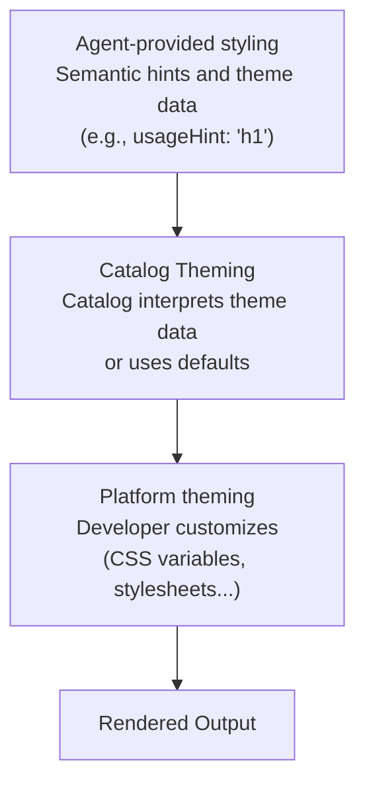

# 主题与样式

自定义 A2UI 组件的外观以匹配你的品牌。

## A2UI 的样式理念

A2UI 默认遵循**渲染器控制的样式**方法，但允许通过目录进行灵活调整：

- **智能体描述*显示什么***（组件和结构）
- **渲染器决定*外观如何***（颜色、字体、间距）

然而，该协议足够灵活，允许智能体在需要时影响样式。

## 样式层

A2UI 样式分层工作：



## 智能体提供的样式信息

### 语义提示

智能体提供语义提示（而非视觉样式）来指导渲染。在*基础目录*中：

```json
{
  "id": "title",
  "component": {
    "Text": {
      "text": {"literalString": "Welcome"},
      "usageHint": "h1"
    }
  }
}
```

**常见的 `usageHint` 值：**

- Text：`h1`、`h2`、`h3`、`h4`、`h5`、`body`、`caption`
- 其他组件有自己的提示（请参阅 [组件参考](../reference/components.md)）

目录元素将这些语义提示映射到目标平台上的实际组件，并对它们进行样式化。

### `theme` 属性

A2UI 协议允许在 `createSurface` 消息中使用任意的 `theme` 属性。目前，此属性在 Zod 模式中定义为 `z.any().optional()`，这意味着智能体可以传递客户端渲染器和目录理解的任何 JSON 结构。

* 在 [server-to-client.ts](../../renderers/web_core/src/v0_9/schema/server-to-client.ts) 中查看模式定义。
* 在 [catalog/types.ts](../../renderers/web_core/src/v0_9/catalog/types.ts) 中查看 `Catalog` 类和 `themeSchema`。

**注意：** *基础目录*组件未连接到使用来自智能体的 `theme`。

_想影响这个设计？在这里参与讨论：[#1118](https://github.com/google/A2UI/issues/1118)。_

## 目录主题化

主题化是目录实现的责任。每个目录都可以提供任何它想要的主题化解决方案。
作为示例，以下是默认*基础目录*的做法：

### Web 基础目录主题化

在 Web 上，默认 A2UI 渲染器提供的*基础目录*通过覆盖 CSS 变量进行主题化。

基础目录组件注入包含这些变量默认值的小型样式表。样式表针对 `:where(:root)`，因此其特异性最低，主机应用可以轻松覆盖它们。

例如，要覆盖主色调，你可以简单地将以下内容添加到应用的 CSS 中：

```css
:root {
  --a2ui-color-primary: #ff5722;
}
```

在 [default.ts](../../renderers/web_core/src/v0_9/basic_catalog/styles/default.ts) 中查看默认样式。

**查看每个平台的一些示例：**

- [Lit 示例](../../samples/client/lit)
- [Angular 示例](../../samples/client/angular)
- [React 示例](../../samples/client/react)

### 逐组件覆盖

除了全局主题化，*基础目录*的每个组件都暴露自定义变量以进一步细化其外观。
例如，`Card` 组件暴露了 `--a2ui-card-background` 变量。

查看每个组件的文档以了解它暴露了哪些变量。

## 常见样式特性

### 暗色模式

默认 Web 渲染器支持基于系统偏好（`prefers-color-scheme`）的自动暗色模式。

要始终强制暗色或亮色模式（或以编程方式控制切换），在生成代码的祖先元素中使用类名 `a2ui-light` 或 `a2ui-dark`。

### 自定义字体

字体可以像任何其他 Web 应用一样加载。*基础目录*组件尝试继承其容器的字体系列，但提供两个可覆盖的值：`--a2ui-font-family-title` 和 `--a2ui-font-family-monospace`，用于为标题和等宽文本块设置不同的字体。

## Flutter

Flutter 具有内置的主题化支持。请参阅：

* [使用主题共享颜色和字体样式](https://docs.flutter.dev/cookbook/design/themes)（来自 Flutter 文档）。

## 最佳实践

### 1. 使用语义提示，而非视觉属性

在定义你的组件时，智能体应提供语义提示（`usageHint`），绝不应提供视觉样式：

```json
// ✅ 好的做法：语义提示
{
  "component": {
    "Text": {
      "text": {"literalString": "Welcome"},
      "usageHint": "h1"
    }
  }
}

// ❌ 不好的做法：视觉属性（不受支持）
{
  "component": {
    "Text": {
      "text": {"literalString": "Welcome"},
      "fontSize": 24,
      "color": "#FF0000"
    }
  }
}
```

### 2. 保持可访问性

- 确保足够的颜色对比度（WCAG AA：普通文本 4.5:1，大文本 3:1）
- 使用屏幕阅读器进行测试
- 支持键盘导航
- 在亮色和暗色模式下进行测试

### 3. 使用设计令牌

定义可复用的设计令牌（颜色、间距等），并在整个样式中引用它们以保持一致性。

### 4. 跨平台测试

- 在所有目标平台（Web、移动、桌面）上测试你的主题化
- 验证亮色和暗色模式
- 检查不同的屏幕尺寸和方向
- 确保跨平台一致的brand体验

## 下一步

- **[定义你自己的目录](defining-your-own-catalog.md)**：使用你的样式构建自定义组件
- **[组件参考](../reference/components.md)**：查看所有组件的样式选项
- **[客户端设置](client-setup.md)**：在你的应用中设置渲染器
